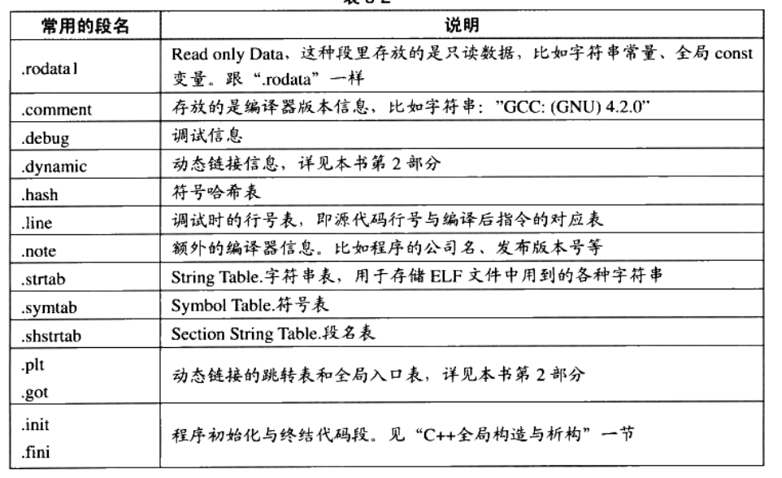
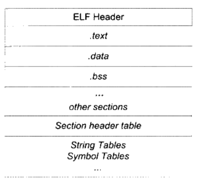

# 第三章 目标文件里有什么

> 《程序员的自我修养--链接、装载与库》第三章

1. ELF文件的生成
2. ELF文件的分析工具及其使用
3. ELF文件的结构、存储规则及指定变量存储段

## 3.1 目标文件格式

| ELF文件类型 | 说明 | 实例 |
| :---: | :---: | :---: |
| 可重定位文件 | 包含代码和数据，可以被用来链接成可执行文件或共享目标文件，<br> 静态链接库也可以归为这一类 | Linux的 `.o` <br> windows的 `.obj` |
| 可执行文件 | 包含了可以直接执行的程序 | 比如 `/bin/bash` 文件 <br> windows 的 `.exe` |
| 共享目标文件 | 动态库 | --- |
| 核心转储文件 | 进程意外终止，系统可以将该进程的地址空间的内容以及终止时的一些其他信息转储到核心转储文件按 | Linux 下的 `core dump` |

``` bash
$ file /bin/bash
/bin/bash: ELF 64-bit LSB pie executable, x86-64, version 1 (SYSV), dynamically linked, interpreter /lib64/ld-linux-x86-64.so.2, BuildID[sha1]=2f77b36371c214e11670c7d9d92727e9a49f626b, for GNU/Linux 3.2.0, stripped
```

``` bash
$ file /lib64/../lib/x86_64-linux-gnu/ld-linux-x86-64.so.2
/lib64/../lib/x86_64-linux-gnu/ld-linux-x86-64.so.2: ELF 64-bit LSB shared object, x86-64, version 1 (GNU/Linux), static-pie linked, BuildID[sha1]=353e1b6cb0eebc08cf3ff812eae8a51b4efd684e, stripped
```

实例代码 3-1

``` c
// simple_section.c
int printf(const char* format, ...);

int g_init_var = 84;
int g_uninit_var;

void func_1(int i)
{
    printf("%d\n", i);
}

int main(void)
{
    static int static_var = 85;
    static int static_var2;

    int a = 0;
    int b;

    func_1(static_var + static_var2 + a + b);

    return a;
}

```

### 3.2 挖掘 simple_section.o

``` bash
$ gcc -c simple_section.c
$ objdump -h simple_section.o

simple_section.o:     file format elf64-x86-64

Sections:
Idx Name          Size      VMA               LMA               File off  Algn
  0 .text         00000062  0000000000000000  0000000000000000  00000040  2**0
                  CONTENTS, ALLOC, LOAD, RELOC, READONLY, CODE
  1 .data         00000008  0000000000000000  0000000000000000  000000a4  2**2
                  CONTENTS, ALLOC, LOAD, DATA
  2 .bss          00000008  0000000000000000  0000000000000000  000000ac  2**2
                  ALLOC
  3 .rodata       00000004  0000000000000000  0000000000000000  000000ac  2**0
                  CONTENTS, ALLOC, LOAD, READONLY, DATA
  4 .comment      0000002c  0000000000000000  0000000000000000  000000b0  2**0
                  CONTENTS, READONLY
  5 .note.GNU-stack 00000000  0000000000000000  0000000000000000  000000dc  2**0
                  CONTENTS, READONLY
  6 .note.gnu.property 00000020  0000000000000000  0000000000000000  000000e0  2**3
                  CONTENTS, ALLOC, LOAD, READONLY, DATA
  7 .eh_frame     00000058  0000000000000000  0000000000000000  00000100  2**3
                  CONTENTS, ALLOC, LOAD, RELOC, READONLY, DATA
```

- `CONTENTS` 表示该段在文件中存在

- `size` 可以查看ELF文件的代码段、数据段和BSS段的长度

``` c
$ size simple_section.o 
text    data     bss     dec     hex filename
222       8       8     238      ee simple_section.o
```

#### 3.2.1 代码段

- `-s` 可以将所有段的内容以十六进制的方式打印出来
- `-d` 参数可以将所有包含指令的段反汇编

``` bash
$ objdump -s -d simple_section.o

simple_section.o:     file format elf64-x86-64

Contents of section .text:
 0000 f30f1efa 554889e5 4883ec10 897dfc8b  ....UH..H....}..
 0010 45fc89c6 488d0500 00000048 89c7b800  E...H......H....
 0020 000000e8 00000000 90c9c3f3 0f1efa55  ...............U
 0030 4889e548 83ec10c7 45f80000 00008b15  H..H....E.......
 0040 00000000 8b050000 000001c2 8b45f801  .............E..
 0050 c28b45fc 01d089c7 e8000000 008b45f8  ..E...........E.
 0060 c9c3                                 ..
Contents of section .data:
 0000 54000000 55000000                    T...U...
Contents of section .rodata:
 0000 25640a00                             %d..
Contents of section .comment:
 0000 00474343 3a202855 62756e74 75203133  .GCC: (Ubuntu 13
 0010 2e332e30 2d367562 756e7475 327e3234  .3.0-6ubuntu2~24
 0020 2e303429 2031332e 332e3000           .04) 13.3.0.
Contents of section .note.gnu.property:
 0000 04000000 10000000 05000000 474e5500  ............GNU.
 0010 020000c0 04000000 03000000 00000000  ................
Contents of section .eh_frame:
 0000 14000000 00000000 017a5200 01781001  .........zR..x..
 0010 1b0c0708 90010000 1c000000 1c000000  ................
 0020 00000000 2b000000 00450e10 8602430d  ....+....E....C.
 0030 06620c07 08000000 1c000000 3c000000  .b..........<...
 0040 00000000 37000000 00450e10 8602430d  ....7....E....C.
 0050 066e0c07 08000000                    .n......

Disassembly of section .text:

0000000000000000 <func_1>:
   0:   f3 0f 1e fa             endbr64
   4:   55                      push   %rbp
   5:   48 89 e5                mov    %rsp,%rbp
   8:   48 83 ec 10             sub    $0x10,%rsp
   c:   89 7d fc                mov    %edi,-0x4(%rbp)
   f:   8b 45 fc                mov    -0x4(%rbp),%eax
  12:   89 c6                   mov    %eax,%esi
  14:   48 8d 05 00 00 00 00    lea    0x0(%rip),%rax        # 1b <func_1+0x1b>
  1b:   48 89 c7                mov    %rax,%rdi
  1e:   b8 00 00 00 00          mov    $0x0,%eax
  23:   e8 00 00 00 00          call   28 <func_1+0x28>
  28:   90                      nop
  29:   c9                      leave
  2a:   c3                      ret

000000000000002b <main>:
  2b:   f3 0f 1e fa             endbr64
  2f:   55                      push   %rbp
  30:   48 89 e5                mov    %rsp,%rbp
  33:   48 83 ec 10             sub    $0x10,%rsp
  37:   c7 45 f8 00 00 00 00    movl   $0x0,-0x8(%rbp)
  3e:   8b 15 00 00 00 00       mov    0x0(%rip),%edx        # 44 <main+0x19>
  44:   8b 05 00 00 00 00       mov    0x0(%rip),%eax        # 4a <main+0x1f>
  4a:   01 c2                   add    %eax,%edx
  4c:   8b 45 f8                mov    -0x8(%rbp),%eax
  4f:   01 c2                   add    %eax,%edx
  51:   8b 45 fc                mov    -0x4(%rbp),%eax
  54:   01 d0                   add    %edx,%eax
  56:   89 c7                   mov    %eax,%edi
  58:   e8 00 00 00 00          call   5d <main+0x32>
  5d:   8b 45 f8                mov    -0x8(%rbp),%eax
  60:   c9                      leave
  61:   c3                      ret

```

- 最左边一列是偏移量
- `0xc3` 是 `ret`

#### 3.2.2 数据段和只读数据段

- `.data` 保存已经初始化了的全局静态变量和局部静态变量 8字节
- `rodata` 只读数据段 %d\n - 4字节

#### 3.2.3 BSS段

存放未初始化的**全局变量**和**局部变量**
- `-x` 可以看符号表

``` bash
$ objdump -x simple_section.o

simple_section.o:     file format elf64-x86-64
simple_section.o
architecture: i386:x86-64, flags 0x00000011:
HAS_RELOC, HAS_SYMS
start address 0x0000000000000000

Sections:
Idx Name          Size      VMA               LMA               File off  Algn
  0 .text         00000062  0000000000000000  0000000000000000  00000040  2**0
                  CONTENTS, ALLOC, LOAD, RELOC, READONLY, CODE
  1 .data         00000008  0000000000000000  0000000000000000  000000a4  2**2
                  CONTENTS, ALLOC, LOAD, DATA
  2 .bss          00000008  0000000000000000  0000000000000000  000000ac  2**2
                  ALLOC
  3 .rodata       00000004  0000000000000000  0000000000000000  000000ac  2**0
                  CONTENTS, ALLOC, LOAD, READONLY, DATA
  4 .comment      0000002c  0000000000000000  0000000000000000  000000b0  2**0
                  CONTENTS, READONLY
  5 .note.GNU-stack 00000000  0000000000000000  0000000000000000  000000dc  2**0
                  CONTENTS, READONLY
  6 .note.gnu.property 00000020  0000000000000000  0000000000000000  000000e0  2**3
                  CONTENTS, ALLOC, LOAD, READONLY, DATA
  7 .eh_frame     00000058  0000000000000000  0000000000000000  00000100  2**3
                  CONTENTS, ALLOC, LOAD, RELOC, READONLY, DATA
SYMBOL TABLE:
0000000000000000 l    df *ABS*  0000000000000000 simple_section.c
0000000000000000 l    d  .text  0000000000000000 .text
0000000000000000 l    d  .data  0000000000000000 .data
0000000000000000 l    d  .bss   0000000000000000 .bss
0000000000000000 l    d  .rodata        0000000000000000 .rodata
0000000000000004 l     O .data  0000000000000004 static_var.1
0000000000000004 l     O .bss   0000000000000004 static_var2.0
0000000000000000 g     O .data  0000000000000004 g_init_var
0000000000000000 g     O .bss   0000000000000004 g_uninit_var
0000000000000000 g     F .text  000000000000002b func_1
0000000000000000         *UND*  0000000000000000 printf
000000000000002b g     F .text  0000000000000037 main


RELOCATION RECORDS FOR [.text]:
OFFSET           TYPE              VALUE
0000000000000017 R_X86_64_PC32     .rodata-0x0000000000000004
0000000000000024 R_X86_64_PLT32    printf-0x0000000000000004
0000000000000040 R_X86_64_PC32     .data
0000000000000046 R_X86_64_PC32     .bss
0000000000000059 R_X86_64_PLT32    func_1-0x0000000000000004


RELOCATION RECORDS FOR [.eh_frame]:
OFFSET           TYPE              VALUE
0000000000000020 R_X86_64_PC32     .text
0000000000000040 R_X86_64_PC32     .text+0x000000000000002b
```

``` bash
$ objdump -x simple_section.o | grep g_uninit_var
0000000000000000 g     O .bss   0000000000000004 g_uninit_var
```

**Quiz 变量存放位置** --
- 静态变量初始化为0，也会被存放在 `.bss` 段

#### 3.2.4 其他段



**自定义段** --
在全局变量或函数之前加上 `__attribute__((section("name")))` 属性就可以把相应的变量或函数放到以 `name` 作为段名的段中

### 3.3 ELF文件结构描述



**ELF** 目标文件格式前部是 **ELF文件头**, 它包含了描述整个文件的基本属性; 紧接着的是各个段, 其中ELF文件中与段有关的重要结构就是 **段表**, 该表描述了ELF文件包含的所有段的信息